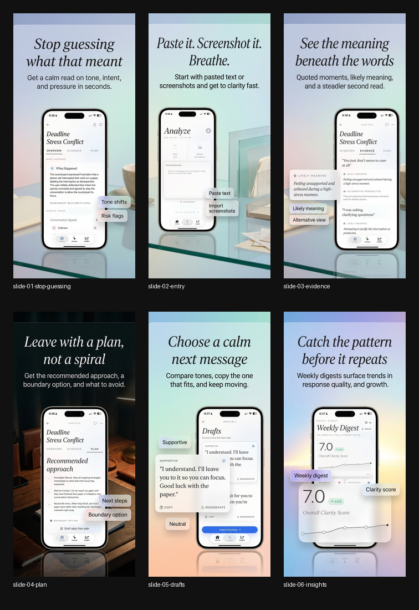
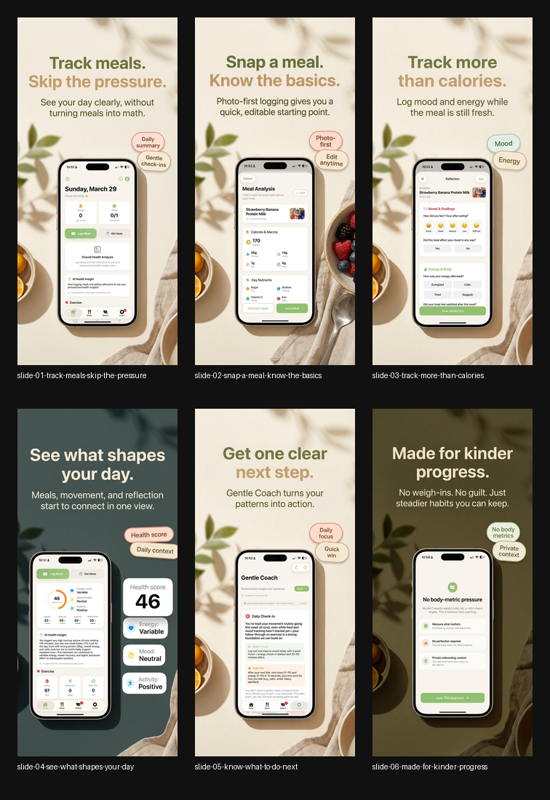
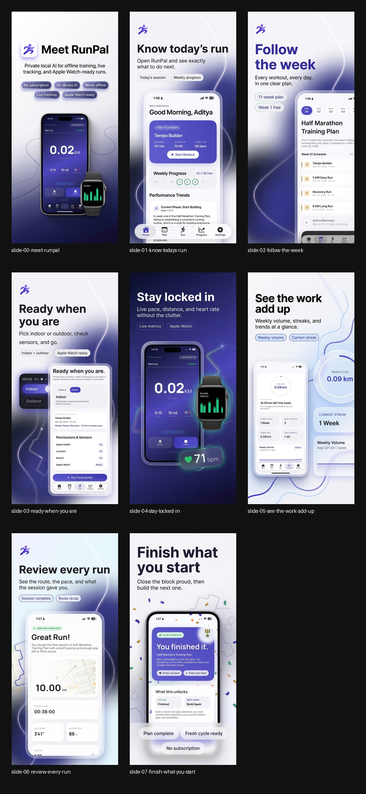

# Nano Banana ASO

An agent skill for building premium, consistent App Store screenshot campaigns with Nano Banana.

This skill helps an agent:
- analyze an app codebase for brand, claims, and differentiators
- decide which app screens should be captured
- write a layout plan before image generation
- lock a style anchor for consistency across the set
- generate advertisement-first App Store slides
- normalize exports to App Store-safe sizes
- build a contact sheet for review

## Workflow

The skill is built around a specific sequence so the screenshot set stays consistent and App Store-safe:

1. Scan the codebase
   - inspect fonts, colors, onboarding copy, pricing language, differentiators, and supported claims
   - identify the app’s strongest user benefit and the real features worth selling

2. Decide the campaign story
   - turn the app into a 5 to 7 slide ad narrative
   - define what each slide should sell in one second

3. Ask for specific screenshots
   - tell the user exactly which screens to capture
   - specify what should be visible in each raw screenshot

4. Write a layout plan
   - lock campaign positioning, story spine, consistency spine, crop-safe rules, and export target
   - use the plan as the source of truth before any image generation starts

5. Convert copy into render-safe prompts
   - keep `<br />` line breaks in planning docs only
   - translate final prompt copy into explicit multi-line headline blocks
   - explicitly tell the image model not to render literal `<br />` characters
   - shorten text-heavy slides before pushing copy toward crop edges

6. Generate a style anchor
   - create slide 1 first with Nano Banana
   - use it to define typography, background language, panel treatment, device treatment, and overall visual family

7. Generate the rest of the set
   - create slides 2 to N as consistent variations of the approved anchor
   - keep the screenshot or product visual as the main focus
   - add relevant supporting imagery when it strengthens the message
   - explicitly lock follow-up slides to the anchor’s headline font family / type style
   - avoid accidental serif drift or giant text-card layouts unless the anchor already uses them

8. Normalize and crop-check exports
   - save raw outputs to `native/`
   - normalize to a final App Store export folder like `export-1320x2868/`
   - verify that no text, screenshot edge, or focal visual gets cropped out
   - use stricter center-safe rules on text-heavy slides, not just the default edge margins

9. Package review assets
   - generate a `prompt-log.md`
   - generate a `contact-sheet.png`
   - present the normalized final set for review

## Included

- `SKILL.md`
- `agents/openai.yaml`
- `references/`
- `scripts/normalize_app_store_exports.py`
- `scripts/build_contact_sheet.py`

## What It Optimizes For

- screenshots as ads, not tutorials
- consistent campaign-wide visual language
- screenshot-led compositions with relevant supporting imagery
- crop-safe layouts that survive final App Store normalization
- a `native/` plus `export-<size>/` workflow
- render-safe headline formatting for image models
- follow-up slides that keep the anchor’s typography voice

## Default Export Pattern

```text
output/
  nano-banana-layout-plan.md
  prompt-log.md
  native/
  export-1320x2868/
  contact-sheet.png
```

## Model Guidance

- Use `Nano Banana` only.
- Before generation, check `GEMINI_API_KEY` first, then `GOOGLE_API_KEY`.
- If neither key is available, ask the user for the Gemini API key before generation.
- Do not switch to another image model as a fallback.

## Install

### skills.sh

Install it directly with [skills.sh](https://skills.sh/):

```bash
npx skills add chawlaaditya/NanoBananaASO
```

### Direct clone

If you want to install it manually into a local Codex skills directory, clone it directly:

```bash
git clone https://github.com/chawlaaditya/NanoBananaASO.git "${CODEX_HOME:-$HOME/.codex}/skills/nano-banana-app-store-campaign"
```

### Codex built-in installer

If you already have the Codex system skills available locally, you can install from GitHub with the built-in installer:

```bash
python3 "${CODEX_HOME:-$HOME/.codex}/skills/.system/skill-installer/scripts/install-skill-from-github.py" \
  --repo chawlaaditya/NanoBananaASO \
  --path .
```

After installing, restart Codex so the new skill is picked up.

## Use

Example prompt:

```text
Use $nano-banana-app-store-campaign to analyze this app, tell me which screenshots to capture, lock a Nano Banana style anchor, and generate a consistent App Store screenshot campaign.
```

## Examples

Here are a few real campaign contact sheets generated with the workflow:

### ClearReply



### GentleCal



### RunPal


